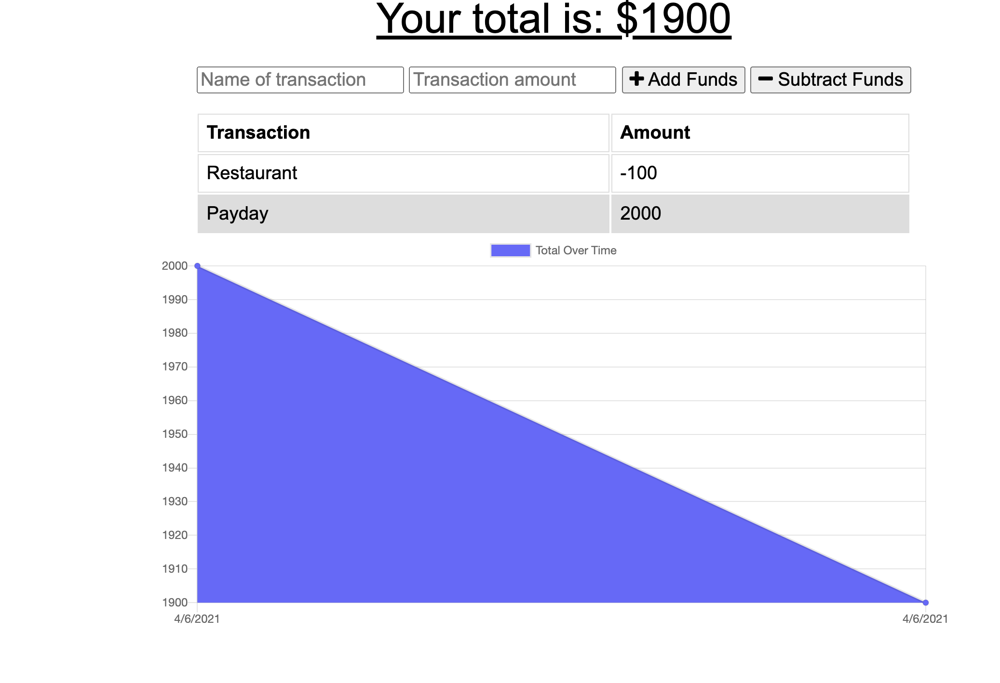

# Expense Tracker

## Description

This application uses service worker to allow the user to track their budget over time both online and offline.

## Table of contents

- [General Info](#general-info)
- [Demo](#demo)
- [Technologies](#technologies)
- [Author](#author)
- [Questions](#questions)

## General Info

This application is deployed [here](https://stark-island-01770.herokuapp.com) on heroku.

## Demo

## Technologies

This project was created with:

- [JavaScript](https://www.javascript.com/)

- [JQuery](https://jquery.com/)

- [Express](https://www.npmjs.com/package/express)

- [Node](https://www.npmjs.com/package/node)

- [MongoDB](https://www.mongodb.com/)

- [Service Worker](https://www.npmjs.com/package/serviceworker)

## Author

- [Shawn Flanigan](https://github.com/Shawnmflanigan)

## Questions

- If you have any questions about installing this application locally please feel free to reach out to me [here](theshawns@gmail.com)
